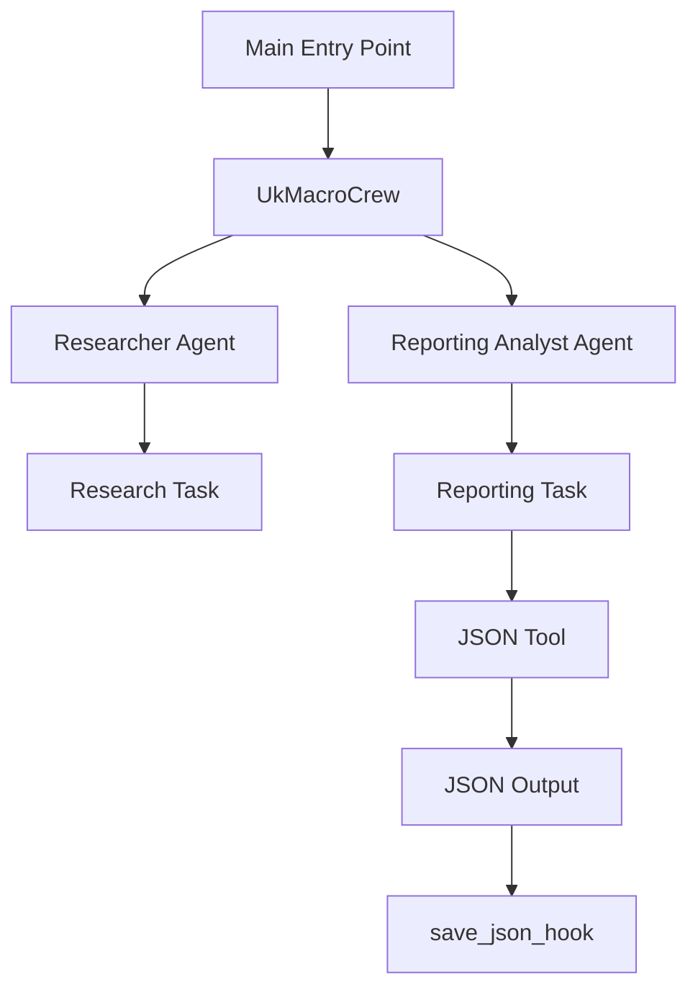

# Design Document: JSON Report System

## Overview

The JSON Report System transforms the existing UK Macro Crew from CSV output to structured JSON data format. This system maintains the existing CrewAI multi-agent architecture while replacing CSV functionality with JSON output capabilities that include AI-generated summaries of Bank of England reports.

The transformation replaces the CSV workflow with a modern JSON-based approach, providing structured data optimized for contemporary data analysis and API integration workflows.

## Architecture

### High-Level Architecture

The system maintains the existing two-agent CrewAI architecture with JSON-focused modifications:



### Agent Modifications

**Researcher Agent**: No changes required - continues to search for economic indicators and BoE report summaries using existing tools (EXASearchTool, ScrapeWebsiteTool).

**Reporting Analyst Agent**: Completely refocused on JSON processing, replacing CSV tool with JSON tool for structured data compilation.

### Data Flow Transformation

1. **Input Processing**: JSON report loading (replaces CSV loading)
2. **Research Phase**: Unchanged - agent searches for economic data and report summaries
3. **Reporting Phase**: JSON output generation (replaces CSV output)
4. **Output Persistence**: JSON save hook (replaces CSV save hook)

## Components and Interfaces

### New Components

#### JSONTool
```python
class JSONTool(BaseTool):
    name: str = "JSON Update Tool"
    description: str = "Updates a JSON report with economic data and AI summaries"
    args_schema: Type[BaseModel] = JSONToolInput
    
    def _run(self, existing_json: str, new_data: str) -> str:
        # Process economic indicators and AI summaries
        # Update time-series data structure
        # Return updated JSON string
```

#### JSONToolInput Schema
```python
class JSONToolInput(BaseModel):
    existing_json: str = Field(..., description="Existing JSON report as string")
    new_data: str = Field(..., description="New economic data and summaries to add")
```

### Replaced Components

#### Reporting Analyst Agent (Modified)
- **Tools**: JSONTool (CSVTool has been removed)
- **Goal**: JSON compilation of economic data and AI summaries
- **Backstory**: Updated to focus on JSON report maintenance

#### Utils Module (Enhanced)
```python
def load_json_report() -> str:
    """Load existing JSON report or return empty structure"""
    
def save_json_hook(result) -> None:
    """Save JSON output after crew execution"""
    
def get_json_filename() -> str:
    """Generate JSON filename (replaces CSV naming)"""
```

### Modified Components

#### Main Entry Point
- **Input Loading**: JSON report loading (replaces CSV loading)
- **Input Dictionary**: Include `json_report` parameter (replaces `csv_report`)

#### UkMacroCrew Class
- **After Kickoff**: `save_json_hook` (replaces `save_csv_hook`)
- **Agent Configuration**: Update reporting_analyst with JSONTool

#### Task Configuration
- **Reporting Task**: Updated expected output to specify JSON format requirements

## Data Models

### JSON Report Structure

```json
{
  "metadata": {
    "generated_at": "2024-01-15T10:30:00Z"
  },
  "economic_indicators": {
    "Jan-24": {
      "interest_rate": {
        "value": "5.25%",
        "date_published": "2024-01-15"
      },
      "cpih_mom": {
        "value": "+0.4%",
        "date_published": "2024-01-12"
      },
      "gdp_mom": {
        "value": "+0.2%",
        "date_published": "2024-01-10"
      }
    }
  },
  "report_summaries": {
    "Jan-24": {
      "monetary_policy_report": {
        "summary": "AI-generated summary of MPR content...",
        "report_date": "2024-01-15"
      },
      "financial_stability_report": {
        "summary": "AI-generated summary of FSR content...",
        "report_date": "2024-01-10"
      }
    }
  }
}
```

### Input Data Format

The system processes research output in the existing bullet-point format:
```
- Interest Rate: 5.25% (Jan-24)
- CPIH +/- MoM: +0.4% (Jan-24)
- GDP +/- MoM: +0.2% (Jan-24)
- Monetary Policy Report Summary: The committee voted to maintain... (Jan-24)
```

### Empty JSON Structure

For new reports, the system starts with:
```json
{
  "metadata": {
    "generated_at": ""
  },
  "economic_indicators": {},
  "report_summaries": {}
}
```

## Correctness Properties

*A property is a characteristic or behavior that should hold true across all valid executions of a system-essentially, a formal statement about what the system should do. Properties serve as the bridge between human-readable specifications and machine-verifiable correctness guarantees.*

### Property Analysis

Based on the requirements analysis, the following properties ensure system correctness:

**Property 1: JSON Structure Consistency**
*For any* valid economic data input, the JSON output should maintain the defined schema structure with metadata, economic_indicators, and report_summaries sections
**Validates: Requirements 1.1, 2.2**

**Property 2: Time Period Organization**
*For any* economic data with MM-YY timestamps, the JSON output should organize all data points under their corresponding time period keys
**Validates: Requirements 1.2, 2.3**

**Property 3: Data Completeness**
*For any* input containing Interest Rates, CPIH +/- MoM, and GDP +/- MoM data, all three indicators should be present in the JSON economic_indicators section
**Validates: Requirements 1.1**

**Property 4: AI Summary Integration**
*For any* Bank of England report summary in the input, it should be properly categorized and included in the report_summaries section with associated metadata
**Validates: Requirements 2.1, 2.2**

**Property 5: File Management Round-Trip**
*For any* existing JSON file, loading then updating then saving should preserve all existing data while adding new information
**Validates: Requirements 3.1, 3.3**

## Error Handling

### File Operations
- **Missing JSON File**: Create new file with proper schema structure
- **Corrupted JSON**: Log error, backup corrupted file, create new structure
- **Permission Errors**: Graceful failure with user notification

### Data Processing
- **Invalid Date Formats**: Skip malformed entries, log warnings
- **Missing Required Fields**: Use default values, mark as incomplete
- **Duplicate Data**: Update existing entries, preserve latest values

### Agent Failures
- **Research Agent Timeout**: Return partial results with status indicators
- **JSON Tool Errors**: Graceful failure with error logging and partial data preservation
- **Network Issues**: Retry with exponential backoff, cache partial results