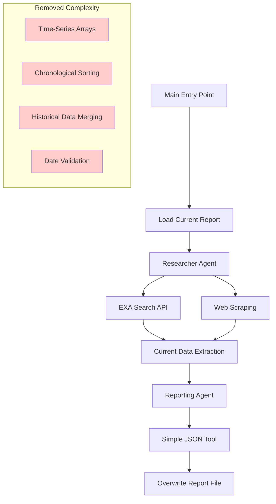

# Design Document

## Overview

The UK Macro Crew system will be transformed from a complex time-series historical tracking system to a streamlined current snapshot generator. This design eliminates the chronological data management complexity while maintaining the robust search capabilities and agent architecture. The system will focus exclusively on retrieving and reporting the most recent available UK macroeconomic data, overwriting the output file on each execution.

## Architecture

### High-Level Architecture

The simplified system maintains the existing CrewAI multi-agent architecture but removes time-series complexity:



### Agent Architecture

**Researcher Agent**: Maintains current search capabilities but focuses only on finding the most recent data
- Uses EXA Search API for authoritative source discovery
- Employs web scraping for data extraction
- Prioritizes official UK sources (ONS, Bank of England)
- Returns only the latest available data point per indicator

**Reporting Agent**: Simplified to handle current data only
- Uses a streamlined JSON tool for simple data formatting
- No chronological processing or historical data management
- Direct file overwrite approach

## Components and Interfaces

### Core Components

#### 1. Simplified JSON Tool
**Purpose**: Replace complex time-series JSON tool with simple current data formatter
**Key Changes**:
- Remove time-series array management
- Remove chronological sorting logic
- Remove historical data merging
- Implement simple key-value data structure
- Direct data replacement instead of merging

**Interface**:
```python
class SimpleJSONTool(BaseTool):
    def _run(self, new_data: str) -> str:
        # Parse new data
        # Create simple JSON structure
        # Return formatted JSON
```

#### 2. Current Data Extractor
**Purpose**: Extract only the most recent data from search results
**Functionality**:
- Parse search results for latest data points
- Validate data currency and authenticity
- Format data with publication dates
- Handle missing data gracefully

#### 3. Simple Report Structure
**Purpose**: Replace complex time-series structure with simple current snapshot

**New Structure**:
```json
{
  "metadata": {
    "generated_at": "2026-01-11T10:30:00Z",
  },
  "economic_indicators": {
    "interest_rate": {
      "value": "3.75%",
      "publication_date": "2025-12-17",
      "source": "Bank of England"
    },
    "cpih_mom": {
      "value": "-0.1%",
      "publication_date": "2025-11-20",
      "source": "ONS"
    },
    "gdp_mom": {
      "value": "-0.1%",
      "publication_date": "2025-10-15",
      "source": "ONS"
    }
  },
  "current_report_summaries": {
    "monetary_policy_report": {
      "summary": "Bank of England reduced Bank Rate to 3.75%...",
      "report_date": "2025-12-17",
      "source": "Bank of England"
    },
    "financial_stability_report": {
      "summary": "Financial system assessment...",
      "report_date": "2025-12-15",
      "source": "Bank of England"
    }
  }
}
```

### Interface Specifications

#### Agent Configuration Updates
**Researcher Agent**:
- Maintain current search tools (EXA, Web Scraping)
- Update goal to focus on "current data only"
- Simplify backstory to remove time-series references

**Reporting Agent**:
- Replace JSONTool with SimpleJSONTool
- Update goal to focus on "current snapshot generation"
- Remove time-series compilation references

#### Task Configuration Updates
**Research Task**:
- Maintain current search strategies
- Focus output on single latest data point per indicator
- Remove month-year formatting requirements
- Simplify expected output format

**Reporting Task**:
- Remove existing JSON report loading
- Implement direct overwrite approach
- Simplify output structure requirements

## Data Models

### Input Data Model
```python
class CurrentDataInput(BaseModel):
    indicator_type: str  # "interest_rate", "cpih_mom", "gdp_mom"
    value: str
    publication_date: str  # ISO format
    source: str
```

### Report Summary Model
```python
class ReportSummaryInput(BaseModel):
    report_type: str  # "monetary_policy_report", "financial_stability_report"
    summary: str
    report_date: str  # ISO format
    source: str
```

### Output Data Model
```python
class SimpleReportOutput(BaseModel):
    metadata: Dict[str, str]
    current_economic_indicators: Dict[str, CurrentDataInput]
    current_report_summaries: Dict[str, ReportSummaryInput]
```

### Data Flow Simplification

**Current Complex Flow**:
1. Load existing time-series JSON
2. Parse new data
3. Find matching time periods
4. Merge or append data
5. Sort chronologically
6. Validate time-series consistency
7. Save updated structure

**New Simplified Flow**:
1. Parse new current data
2. Format into simple structure
3. Overwrite existing file
4. Complete

## Correctness Properties

*A property is a characteristic or behavior that should hold true across all valid executions of a system-essentially, a formal statement about what the system should do. Properties serve as the bridge between human-readable specifications and machine-verifiable correctness guarantees.*

Let me analyze the acceptance criteria to determine which are testable as properties:

### Correctness Properties

Based on the prework analysis and property reflection, here are the key correctness properties for the simplified system:

**Property 1: Most recent data selection**
*For any* set of multiple data points for the same indicator, the system should select and return only the most recent one based on publication date
**Validates: Requirements 1.4**

**Property 2: Unavailable data handling**
*For any* missing economic indicator or report summary, the system should include a "not available" or equivalent status in the output rather than omitting the field entirely
**Validates: Requirements 1.5, 2.4, 6.1, 6.2**

**Property 3: Publication date inclusion**
*For any* economic indicator or report summary in the output, the system should include the publication date or report date respectively
**Validates: Requirements 1.6, 2.5, 3.5, 3.7**

**Property 4: Report summary generation**
*For any* available report data, the system should generate a brief summary rather than including raw report content
**Validates: Requirements 2.3**

**Property 5: Simple structure enforcement**
*For any* system output, the JSON structure should contain only current data points without historical arrays, time-series structures, or chronological sorting
**Validates: Requirements 3.1, 3.3, 4.2, 4.4, 5.1, 5.3**

**Property 6: Metadata inclusion**
*For any* system output, the JSON should include metadata with a report generation timestamp
**Validates: Requirements 3.2**

**Property 7: Single value per indicator**
*For any* economic indicator or report type in the output, there should be exactly one current value rather than multiple values or arrays
**Validates: Requirements 3.4, 3.6**

**Property 8: File overwrite behavior**
*For any* system execution, the output should completely replace the existing report file rather than appending or merging with previous data
**Validates: Requirements 4.1, 4.3**

**Property 9: Partial data resilience**
*For any* execution where some indicators are missing, the system should complete successfully and produce output with available data rather than failing completely
**Validates: Requirements 6.3, 6.4**

**Property 10: Official source prioritization**
*For any* data included in the output, the source field should reference official UK government or Bank of England sources
**Validates: Requirements 7.3**

## Error Handling

### Simplified Error Scenarios

The simplified system maintains robust error handling while removing time-series complexity:

#### Data Retrieval Failures
- **Missing Indicators**: Mark as "not available" rather than failing
- **Search API Failures**: Continue with partial results
- **Invalid Data Formats**: Skip invalid data, process valid data

#### Processing Errors
- **JSON Formatting Issues**: Use fallback simple structure
- **Date Parsing Failures**: Use current date as fallback
- **Summary Generation Failures**: Mark report as "not available"

#### File Operations
- **Write Permission Issues**: Log error and raise exception
- **Disk Space Issues**: Log error and raise exception
- **File Corruption**: Overwrite with new data (no backup needed)

### Error Handling Simplifications

**Removed Error Scenarios**:
- Time-series consistency validation
- Chronological ordering errors
- Historical data merge conflicts
- Date sequence validation
- Cross-temporal data validation

**Maintained Error Scenarios**:
- API rate limiting and timeouts
- Network connectivity issues
- Invalid search results
- Authentication failures
- File system errors

## Testing Strategy

### Dual Testing Approach

The system will use both unit tests and property-based tests for comprehensive coverage:

**Unit Tests**: Focus on specific examples, edge cases, and error conditions
- Test specific data formats and edge cases
- Test error handling scenarios
- Test integration points between components
- Validate specific JSON structure examples

**Property Tests**: Verify universal properties across all inputs
- Test correctness properties with randomized inputs
- Verify system behavior across wide input ranges
- Validate data structure consistency
- Test resilience with various failure scenarios

### Property-Based Testing Configuration

- **Testing Library**: Use Hypothesis for Python property-based testing
- **Test Iterations**: Minimum 100 iterations per property test
- **Test Tagging**: Each property test tagged with: **Feature: simple-report-generation, Property {number}: {property_text}**
- **Property Implementation**: Each correctness property implemented as a single property-based test

### Testing Focus Areas

**Core Functionality Tests**:
- Data extraction and formatting
- JSON structure generation
- File overwrite behavior
- Error handling and resilience

**Integration Tests**:
- End-to-end workflow execution
- Agent interaction and data flow
- External API integration
- File system operations

**Performance Tests**:
- Execution time comparison with time-series approach
- Memory usage optimization
- API call efficiency

### Test Data Patterns

**Simple Current Data Structure**:
```json
{
  "metadata": {
    "generated_at": "2026-01-11T10:30:00Z",
    "data_currency": "Latest available"
  },
  "current_economic_indicators": {
    "interest_rate": {
      "value": "3.75%",
      "publication_date": "2025-12-17",
      "source": "Bank of England"
    }
  },
  "current_report_summaries": {
    "monetary_policy_report": {
      "summary": "Brief summary...",
      "report_date": "2025-12-17",
      "source": "Bank of England"
    }
  }
}
```

**Missing Data Handling**:
```json
{
  "current_economic_indicators": {
    "interest_rate": {
      "status": "not available",
      "last_checked": "2026-01-11T10:30:00Z"
    }
  }
}
```

### Test Environment Requirements

- **Isolated Testing**: Tests use temporary directories and mock external APIs
- **Deterministic Results**: Mock time-dependent functions for consistent testing
- **Fast Execution**: All tests should complete within 30 seconds
- **No External Dependencies**: Tests should not require live API access

This simplified testing approach removes the complexity of time-series validation while maintaining comprehensive coverage of the core functionality.